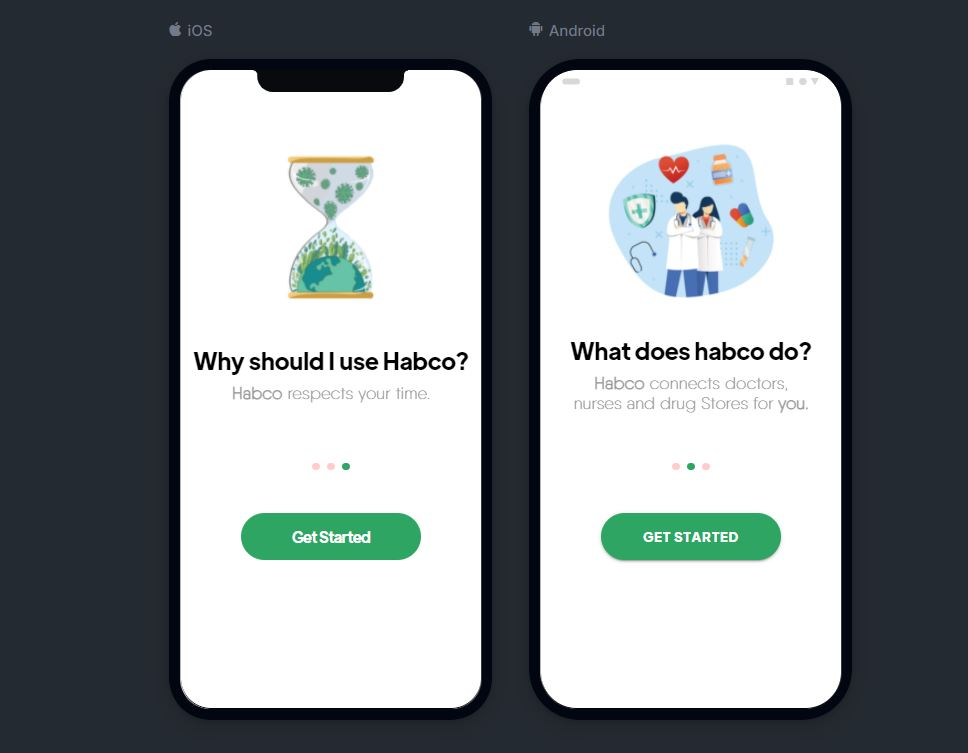
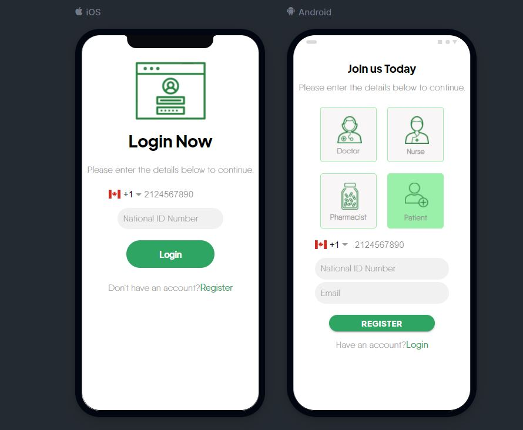

# Habco Application

This is my first PWA project that implemented in **IONIC framework**. This application aims at connecting patients, doctors, drugstores and nurses. In this project I've designed 31 pages. here I've bring you some pages that implemented:


<p align="center">
  

</p>

<p align="center">
  

</p>

<p align="center">
  

</p>


for seeing other pages designs you can use the following command after cloning the repository:

`ionic lab`

## Ionic Overview

### What is Ionic?

* Open source, mobile-optimized ibrary for HTML/JS/CSS
* Built on top of Angular Framework
* Built for native Cordova apps

### Ionic Command Line Features

```bash
#starts a new ionic project
ionic start
```

```bash
#Starts a local development server
ionic serve
```

```bash
#configure platform targets
ionic platform add ios
```

```bash
#locally build app for a platform
ionic build
```

```bash
#emulate app in simulator
ionic emulate
```

```bash
#run app on device
ionic run
```

### Starting a New Project

* We install node to get npm


```bash
$ ionic start [appName] [template]
$ ionic start myApp blank
```

### Run Your App

We can run the app in different ways:

* Local Browser: ionic serve (localhost:8100)
* Emulator: ionic emulate
* Device: ionic run

First remember to install the SDK appropiate.

```bash
ionic add platform ios
ionic build ios
ionic emulate ios
# or
# which builds and deploys to the device
ionic run ios
```
### Publishing a Native Application

You can now make use of all of the ionic components in your React application.
If you want to publish your app to the App Store or Google Play you will need to use the ionic cli to execute Capacitor commands to do so.

More information on this can be found here. https://ionicframework.com/docs/cli
If you want to learn more about Capacitor our dedicated site can be found here. https://capacitor.ionicframework.com/

The commands that you will need to execute are below in your project's root.
```sh
ionic init "My React App" --type=custom
ionic integrations enable capacitor
```

Open the './capacitor.config.json' file in your projects root.
Change `"webDir": "www"` to be `"webDir": "build"` (dependent on your config but create-react-app defaults with this as the build directory)

Then run the following command to get started with either `ios` or `android` platforms.
```
ionic capacitor add <android|ios>
```

After build you build your app you will need to copy your capacitor resources into the build dir so execute the following command.
```
ionic capacitor copy
```

To open your application to build/emulate in Android Studio or Xcode run the `open` command.
```
ionic capacitor open <android|ios>
```

## Related

* [Ionic Documentation](https://ionicframework.com/docs/)
* [Ionic Worldwide Slack](http://ionicworldwide.herokuapp.com/)
* [Ionic Forum](https://forum.ionicframework.com/)
* [Ionicons](http://ionicons.com/)
* [Capacitor](https://capacitor.ionicframework.com/)

